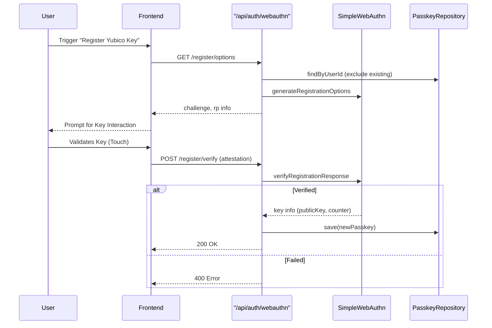
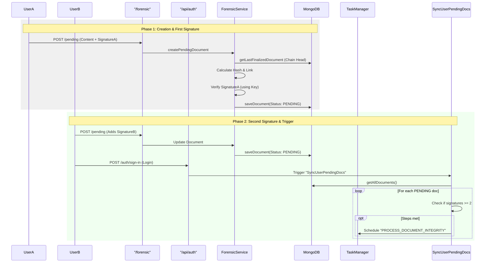
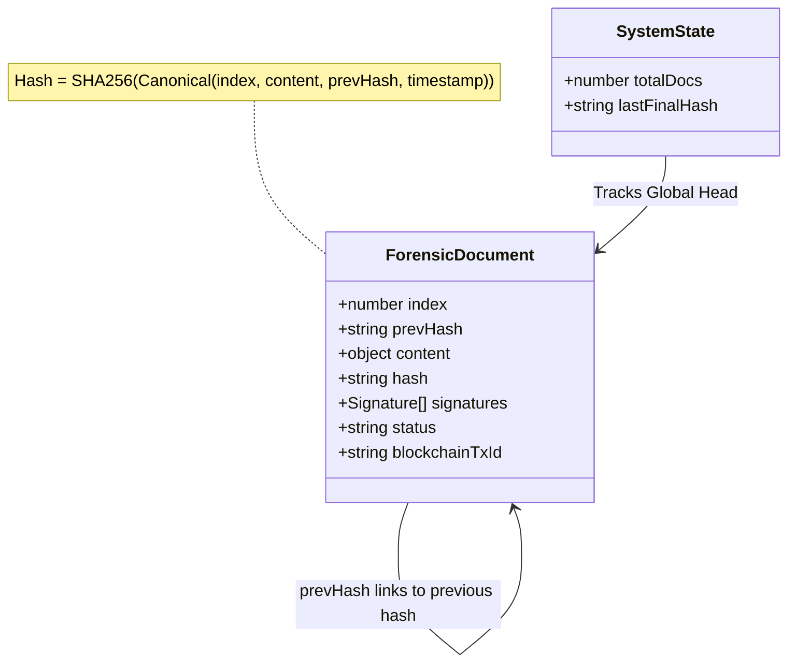

# Application Flow Diagrams

## 1. Authentication & Key Management
> **Note**: The current implementation supports **WebAuthn Registration** (for Yubico/Passkeys). Explicit WebAuthn **Login** endpoint was not found in the custom controller, but the registered keys are used for **Document Signing**.

### WebAuthn Registration (Yubico Key Setup)


## 2. Document Creation & Signing (Async Flow)
This flow describes how a document is created, signed by users, and then verified asynchronously.



## 3. Async Verification & Blockchain Anchoring
This explains the "Async two-step document hashing with blockchain usage" and "Document history verification".

```mermaid
flowchart TD
    subgraph Step1 [Step 1: Integrity Verification]
        Queue1[Task: PROCESS_DOCUMENT_INTEGRITY] --> Handler1(ProcessDocumentIntegrity Handler)
        Handler1 --> FetchDoc[Fetch Document by Index]
        FetchDoc --> CheckHash{Verify Hash?}
        CheckHash -- Mismatch --> Error1[Throw Error / Integrity Fail]
        CheckHash -- Match --> CheckSigs[Verify Signatures]
        
        CheckSigs --> LoopSigs{For each Signature}
        LoopSigs --> FetchKey[Fetch Public Key from PasskeyRepo]
        FetchKey --> VerifySig[Crypto Verify]
        VerifySig -- Invalid --> Error2[Throw Error]
        VerifySig -- Valid --> LoopSigs
        
        LoopSigs -- All Valid --> SchedNext[Schedule BLOCKCHAIN_PUBLISH]
    end

    subgraph Step2 [Step 2: Blockchain Anchoring]
        Queue2[Task: BLOCKCHAIN_PUBLISH] --> Handler2(BlockchainPublish Handler)
        Handler2 --> FetchDoc2[Fetch Document]
        FetchDoc2 --> CheckAnchor{Already Anchored?}
        CheckAnchor -- No --> Anchor[Call BlockchainService.anchorHash]
        Anchor --> SaveTx[Save blockchainTxId]
        CheckAnchor -- Yes --> SkipAnchor[Skip Anchoring]
        
        SaveTx --> Finalize[Set Status = FINALIZED]
        Finalize --> UpdateState[Update SystemState (Head Hash)]
    end

    SchedNext --> Queue2
```

## 4. Document History Verification Mechanism (Chain)



**Verification Mechanism:**
1. **Chain Linking:** Each document contains `prevHash` which must match the `hash` of the document at `index - 1`.
2. **Content Integrity:** The `hash` of the document is derived from its content, index, `prevHash`, and creation timestamp. Any change invalidates the hash.
3. **Signature Authority:** Signatures are verified against public keys stored in `PasskeyRepository` (Yubico keys).
4. **Blockchain Anchor:** The `hash` is anchored to a blockchain (Step 2), providing an immutable timestamp and proof of existence. `verifyAnchor` can confirm the document hasn't been altered since anchoring.
