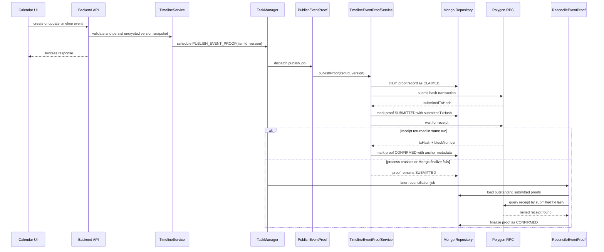
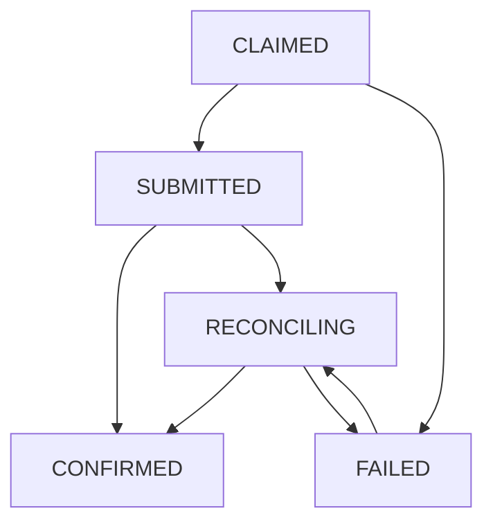

# Timeline Event Proof Flow Through Phase 1

This document describes the target end-to-end flow for signing a timeline event from the calendar UI through the Phase 1 hardening milestone.

It is intentionally split into two views:
- the baseline event-proof flow,
- the Phase 1 hardened flow that adds explicit lifecycle state, `submittedTxHash` persistence, and reconciliation.

This is the flow we want to track in issue `#35` while the work is delivered in phases.

## Why this document exists

The event-proof feature solves one problem well: mutable calendar events need proof for a specific immutable version snapshot, not for the live Mongo document.

The malicious-admin discussion adds a second problem: the system also needs better protection against the window where a proof transaction was sent or even mined, but Mongo never stored the final confirmation state.

Phase 1 does not redesign timeline history into an append-only ledger yet. It closes the highest-value operational gap first.

## Actors in the flow

- Calendar UI
- `TimelineController`
- `TimelineApiService`
- `TimelineService`
- `TaskManager`
- `PublishEventProof` scheduler handler
- `TimelineEventProofService`
- `TimelineRepository`
- `ViemBlockchainAnchor` or `MockBlockchainAnchor`
- Phase 1 reconciliation service and scheduler handler
- Polygon RPC

## Baseline flow before Phase 1

### 1. User writes an event in the calendar

The calendar UI sends a timeline write request such as:
- `POST /api/timeline`
- `PATCH /api/timeline/:id`
- `DELETE /api/timeline/:id`

The request already carries encrypted event content. The backend never proves the mutable live event directly.

### 2. The backend creates or updates an immutable version snapshot

`TimelineController` passes the request into `TimelineApiService`, then into `TimelineService`.

`TimelineService` persists timeline state and stores a version snapshot that can be hashed deterministically later. This is the key invariant: every blockchain proof points to one exact version snapshot.

### 3. The backend schedules proof publication

After the event version is persisted, `TimelineService` schedules `PUBLISH_EVENT_PROOF` with a payload shaped like:

```ts
{ itemId, version }
```

This step is asynchronous. The user write flow does not wait for Polygon mining.

### 4. The scheduler claims the proof job

`TaskManager` prevents duplicate active tasks for the same `(itemId, version)` and dispatches the work to `PublishEventProof`.

That handler calls `TimelineEventProofService.publishProof(itemId, version, { retryPending: true })`.

### 5. The proof service calculates the hash for the version snapshot

`TimelineEventProofService` loads the timeline item, selects the requested version entry, and computes a deterministic hash from the immutable encrypted snapshot.

The service never hashes the live mutable event state at read time.

### 6. The repository claims the right to publish

Before any blockchain write happens, the repository creates a pending proof marker for the target `(itemId, version, hash)` if no matching proof exists yet.

This is one of the core idempotency barriers. It prevents duplicate on-chain publication when two callers race.

### 7. The blockchain adapter sends the transaction

`ViemBlockchainAnchor.publishHash(hash)` sends the proof transaction to Polygon and waits for the receipt.

If the current environment is local or explicitly mocked, `MockBlockchainAnchor` returns deterministic test values instead.

### 8. The backend finalizes the proof

When the receipt is available, the backend stores:
- `txHash`
- `blockNumber`
- `anchoredAt`

inside the matching proof entry for that exact version.

### 9. The frontend reads the latest anchored proof

`GET /api/events/:id/proof` scans the latest versions and returns the most recent fully anchored proof. Pending markers are ignored.

## Baseline weakness before Phase 1

The hardest failure case is:
- Polygon accepted the transaction,
- maybe the transaction was mined,
- but the backend crashed or Mongo write failed before final proof metadata was stored.

At that point the chain may be correct while the app still thinks the proof is pending or missing.

That gap is exactly what Phase 1 hardens.

## Phase 1 target changes

Phase 1 adds three capabilities:

1. explicit lifecycle state for each proof record,
2. immediate persistence of `submittedTxHash`,
3. reconciliation that can query Polygon later and heal Mongo state.

The target proof lifecycle becomes:
- `CLAIMED`
- `SUBMITTED`
- `CONFIRMED`
- `FAILED`
- `RECONCILING`

## Hardened flow through Phase 1

### 1. Calendar write flow stays asynchronous

The UI and `TimelineService` flow stay the same:
- persist the event version,
- schedule proof publication in the background.

This phase does not change the user-facing save path.

### 2. Proof claim becomes an explicit lifecycle transition

When `TimelineEventProofService` claims the proof slot, the record is written with:
- `status: CLAIMED`
- `hash`
- `version`
- timestamps and minimal tracking metadata if available.

This replaces the old implicit meaning of "proof exists but has no chain metadata yet".

### 3. Transaction submission is stored immediately

After the blockchain adapter returns a transaction hash, but before the backend waits for final receipt confirmation, the repository updates the proof record to:

- `status: SUBMITTED`
- `submittedTxHash`
- `lastAttemptAt`

This is the biggest Phase 1 change.

From this point on, the system has enough external reference to ask Polygon later what happened, even if the process dies before receipt finalization.

### 4. Confirmation becomes a second explicit transition

If receipt waiting succeeds in the normal publication flow, the same record moves to:
- `status: CONFIRMED`
- `txHash`
- `blockNumber`
- `anchoredAt`

The implementation should preserve merge-safe updates so that later partial writes cannot erase already confirmed data.

### 5. Failures leave a recoverable trail

If the backend fails after submission but before confirmation, the proof is not "lost" anymore.

The record still carries:
- `status: SUBMITTED`
- `submittedTxHash`

If the submission failed before any tx hash was returned, the proof can remain `CLAIMED` or move to `FAILED` depending on policy.

### 6. Reconciliation can query Polygon later

Phase 1 adds a reconciliation path that scans proof records in states such as:
- `SUBMITTED`
- stale `CLAIMED`
- optionally `RECONCILING`

For each record with a stored transaction hash, the reconciliation service asks Polygon for the receipt.

If the receipt exists, the service finalizes the proof as `CONFIRMED` without creating a new blockchain transaction.

If the receipt is still missing, the record stays outstanding for a later retry or operator review.

### 7. Operators get a real status model

Instead of showing only:
- anchored proof, or
- proof not found,

the system can start exposing status-oriented information for support and recovery tooling.

That helps distinguish:
- not started,
- claimed but not yet submitted,
- submitted and waiting for confirmation,
- confirmed,
- failed,
- under reconciliation.

## Phase 1 sequence diagram



## State machine after Phase 1



## What Phase 1 fixes

Phase 1 fixes the most dangerous distributed-systems blind spot:
- tx submitted to Polygon,
- local DB not finalized,
- no durable pointer to recover from.

With Phase 1 in place, the system can still prove later that:
- a specific submission attempt existed,
- which tx hash was returned,
- whether the chain eventually mined it,
- and whether Mongo was healed afterward.

## What Phase 1 does not fix yet

Phase 1 does not yet stop a malicious admin from rewriting local history before it is externally committed.

It does not introduce:
- append-only timeline version records,
- per-version hash chaining,
- periodic ledger checkpoints,
- client signatures.

Those remain future phases because they are a larger data-model redesign.

## Practical result of Phase 1

After Phase 1, the event proof flow is still based on timeline version snapshots and background Polygon publication, but it becomes materially more robust operationally.

The app no longer depends on a single best-effort receipt write at the end of one process lifetime. Instead, it keeps enough durable submission state to reconcile proof records against Polygon later and continue tracking progress in issue `#35` with concrete milestones.
