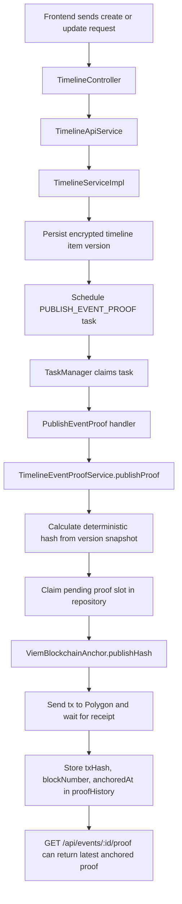
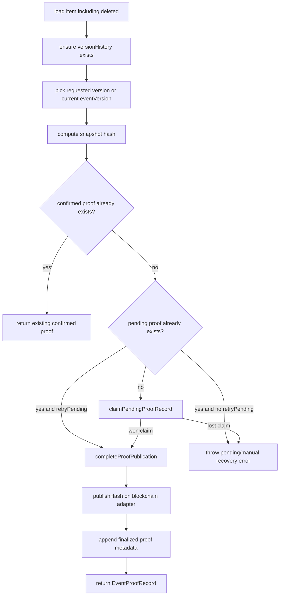
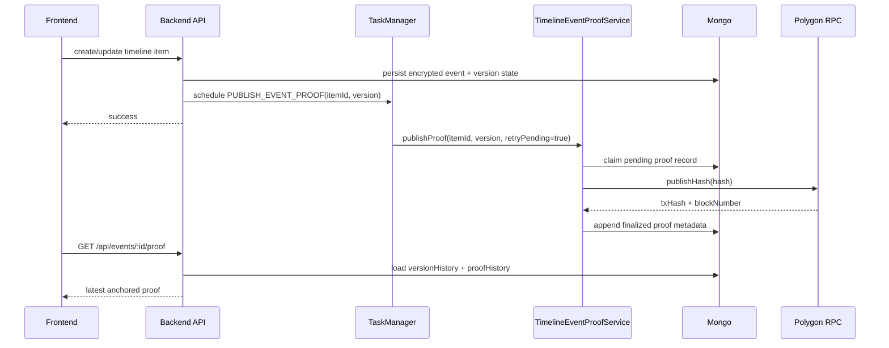
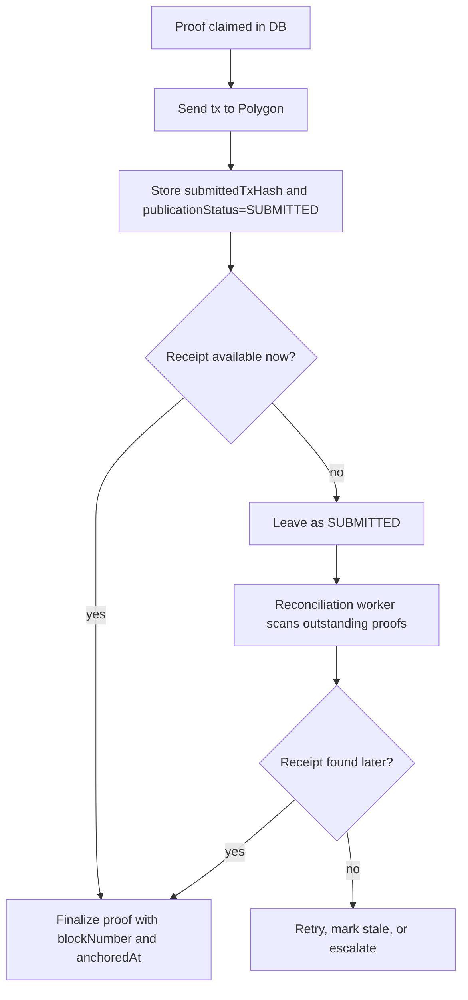

# Timeline Event Proof on Polygon - How It Works

## What this mechanism does

This project does **not** sign the live mutable calendar event directly.

Instead, it signs a **specific immutable version snapshot** of a timeline item and anchors the resulting hash on Polygon.

In practice that means:

- a calendar item can be edited many times,
- every important state is represented as a versioned snapshot,
- the blockchain proof is attached to a concrete version,
- later edits do not silently mutate the meaning of an already anchored proof.

The proof stored in the app is an `EventProofRecord` with:

- `version`
- `hash`
- `txHash`
- `blockNumber`
- `anchoredAt`

Implementation source of truth:

- `backend/src/domain/events/model/TimelineItem.ts`
- `backend/src/domain/events/service/TimelineEventProofService.ts`
- `backend/src/adapters/mongo/repositories/events/MongoTimelineRepository.ts`
- `backend/src/adapters/blockchain/ViemBlockchainAnchor.ts`

---

## Mental model in one sentence

The app takes an encrypted snapshot of a chosen event version, hashes it deterministically, schedules or executes blockchain publication, and stores the Polygon transaction metadata back inside that exact event version's `proofHistory`.

---

## What is actually anchored

For timeline events, the blockchain flow anchors the hash of an `EncryptedTimelineVersionSnapshot`, not the current mutable database record.

That snapshot contains fields such as:

- `id`
- `type`
- `date`
- `createdAt`
- `createdBy`
- `createdByName`
- `auditTrail`
- `isDeleted`
- `childIds`
- `encryption`
- `encryptedPayload`
- optional `ciphertext`

So if a user edits a note later, the already anchored version still points to the old snapshot, and the new content requires a new proof for the new version.

---

## High-level flow



---

## The main code path

### 1. User creates or updates a timeline item

The main write endpoints are in `backend/src/adapters/rest/events/TimelineController.ts`:

- `POST /api/timeline`
- `PATCH /api/timeline/:id`
- `DELETE /api/timeline/:id`

These delegate into `TimelineApiService`, then into `TimelineServiceImpl`.

`TimelineServiceImpl` is the place that schedules proof publication:

- `backend/src/domain/events/service/TimelineService.ts:54`

It calls:

```ts
taskManager.schedule(TaskType.PUBLISH_EVENT_PROOF, { itemId, version }, { retryPolicy: { maxRetries: 5, initialDelayMinutes: 1 } })
```

Important detail:

- the task is scheduled asynchronously,
- the user request does not wait for Polygon mining,
- if scheduling fails, the code logs an error and includes a recovery hint: `POST /api/events/:id/proof/publish`.

So the normal UX is: save first, publish proof in the background.

---

### 2. The scheduler picks up the proof publication task

The handler registration lives in:

- `backend/src/config/registerSchedulerHandlers.ts`

The dedicated handler is:

- `backend/src/scheduler/handlers/PublishEventProof.ts`

It calls:

```ts
eventProofService.publishProof(payload.itemId, payload.version, { retryPending: true })
```

That `retryPending: true` matters a lot:

- background flow is allowed to continue a previously pending proof,
- manual flow can be stricter,
- this reduces the chance that a crash leaves the record forever stuck in a pending state.

---

### 3. TaskManager provides queueing, locking, and retry behavior

Task infrastructure lives in:

- `backend/src/scheduler/TaskManager.ts`
- `backend/src/scheduler/types.ts`

The most important behavior:

- tasks have a `type`, `payload`, `payloadHash`, `status`, retry metadata and lock metadata,
- duplicate active tasks are prevented by a Mongo unique partial index on `{ type, payloadHash }` for statuses `NEW`, `PENDING`, `PROCESSING`,
- the payload for event proof is `{ itemId, version }`, so deduplication is per item version, not just item id,
- the worker claims one task at a time,
- a failed task is retried with exponential backoff,
- a timed-out task is marked `TIMED_OUT`,
- after max retries it becomes `FAILED`.

For `PUBLISH_EVENT_PROOF`, this means two separate protections exist:

1. queue-level deduplication in `TaskManager`
2. repository-level proof claim inside `TimelineEventProofService`

Those two layers are complementary, not redundant.

---

## How `TimelineEventProofService` works

Main file:

- `backend/src/domain/events/service/TimelineEventProofService.ts`

### Step-by-step logic



### Key design choices

#### A. It works on version snapshots

The service does not hash the raw current DB object directly. It selects a concrete version entry and hashes its `snapshot`.

This is what gives the proof legal and forensic stability over time.

#### B. It returns existing confirmed proof if already anchored

If the same hash already has:

- `txHash`
- `blockNumber`
- `anchoredAt`

then the method returns that existing proof instead of publishing again.

That is the first idempotency layer.

#### C. It distinguishes pending proof from confirmed proof

A proof with only:

- `version`
- `hash`

but without blockchain metadata is treated as pending.

This means the app can record intent first, then finalize later.

#### D. It atomically claims the right to publish

This is the most important protection against duplicate on-chain costs.

The service calls:

```ts
repository.claimPendingProofRecord(id, { version, hash })
```

Only the caller that successfully creates the pending marker proceeds to `publishHash()`.

If another concurrent caller loses the claim, it gets:

`Proof publication already pending ... manual recovery required`

That is the second idempotency layer.

#### E. It finalizes publication in a separate step

After the Polygon transaction succeeds, `completeProofPublication()` writes:

- `txHash`
- `blockNumber`
- `anchoredAt`

back into the matching proof entry.

---

## Mongo persistence details

Main file:

- `backend/src/adapters/mongo/repositories/events/MongoTimelineRepository.ts`

### Why proof history is tricky

Each timeline version has its own:

- `snapshot`
- `proofHistory[]`

So persistence must update a nested array inside a specific version entry.

### Current important methods

#### `claimPendingProofRecord(...)`

This does an atomic conditional update:

- find item by `id`
- find target version by `versionHistory.version`
- ensure there is no proof with the same `hash`
- push `{ version, hash }` into that version's `proofHistory`

If the conditional update succeeds, caller wins the claim.
If not, repository checks whether the proof already exists and returns `false` instead of duplicating it.

#### `appendProofRecord(...)`

This is used for finalizing a proof or merging updates.

Important behavior after the latest fix:

- if a proof with the same hash already exists, Mongo does **field-level merge**, not whole-object replacement,
- this preserves already anchored metadata,
- a later partial update cannot erase `txHash`, `blockNumber`, or `anchoredAt`.

This matters in concurrency and recovery scenarios.

### In-memory repository behavior

The test double in:

- `backend/src/adapters/mongo/inmemory/events/InMemoryTimelineRepository.ts`

merges proof entries in memory using object spread. The Mongo repository now matches that behavior more closely.

---

## Polygon adapter behavior

Main file:

- `backend/src/adapters/blockchain/ViemBlockchainAnchor.ts`

There are **two blockchain flows** in the project:

### 1. Timeline event proof flow

Uses:

- `publishHash(hash): Promise<{ txHash, blockNumber }>`

Behavior:

- send transaction
- wait for transaction receipt
- return `txHash` and `blockNumber`

This is used for timeline event proofs because the app wants a fully anchored proof record, not just “transaction was submitted”.

### 2. Legacy forensic flow

Uses:

- `anchorHash(hash): Promise<string>`

Behavior:

- send transaction
- return tx hash immediately
- do not wait for receipt

That path exists to preserve the old forensic scheduler behavior.

So: timeline items wait for mining, forensic documents do not.

---

## How proof is read back by the API

Main file:

- `backend/src/domain/events/service/TimelineApiService.ts`

`getEventProof(id, user)` does this:

- loads item including deleted,
- verifies the item belongs to the caller's family,
- scans `versionHistory` from newest to oldest,
- inside each version scans `proofHistory` in reverse,
- returns the latest proof that has full anchored metadata.

So the read API intentionally ignores pending markers and only returns fully anchored proofs.

This endpoint is:

- `GET /api/events/:id/proof`

There is also a manual recovery endpoint:

- `POST /api/events/:id/proof/publish`

In production it is guarded by:

- `ENABLE_EVENT_PROOF_RECOVERY_ENDPOINT=true`

---

## Idempotency: where it exists and what it means

This is the most important operational topic.

## Layer 1: task-level deduplication

TaskManager deduplicates active tasks for the same:

- `type = PUBLISH_EVENT_PROOF`
- `payloadHash(itemId, version)`

Meaning:

- scheduling the same proof task twice while one is already active is effectively a no-op,
- but this alone does not protect against direct service calls outside the task queue.

## Layer 2: service-level idempotency

`TimelineEventProofService.publishProof()`:

- returns the already confirmed proof if one exists,
- can continue a pending proof if `retryPending: true`,
- otherwise rejects duplicate pending publication.

## Layer 3: repository-level atomic claim

`claimPendingProofRecord()` ensures only one caller inserts the pending proof marker for a given `(itemId, version, hash)`.

This is what prevents duplicate on-chain publication when two requests race.

## Layer 4: merge-safe finalization

`appendProofRecord()` now merges only present fields into an existing proof entry.

That prevents data loss if a late partial write arrives after a fully anchored proof was already stored.

---

## Failure scenarios

## 1. Frontend failure

### Case A: frontend crashes before request is sent

Result:

- no item write,
- no version snapshot update,
- no proof task.

Nothing happens server-side.

### Case B: frontend sends create/update, then crashes before user sees the response

Result depends on whether backend finished the request.

If backend already persisted the item:

- item exists,
- proof task may already be scheduled,
- user may think the action failed even though backend accepted it.

This is a standard at-least-once UX ambiguity. The blockchain flow is protected because later repeats hit idempotency layers.

### Case C: frontend asks for proof too early

`GET /api/events/:id/proof` may still return “proof not found” because:

- background task has not run yet,
- or transaction is still being finalized,
- or publication failed and is waiting for retry.

This is expected. A missing proof does not always mean a broken flow.

---

## 2. Backend API failure

### Case A: item saved, but scheduling task fails

This is explicitly handled in `TimelineServiceImpl.scheduleEventProof()`.

Behavior:

- request path does not crash because scheduling is fire-and-forget,
- backend logs error with `itemId`, `version` and recovery hint,
- user data is saved, but blockchain proof is not queued automatically.

Recovery path:

- use `POST /api/events/:id/proof/publish`

This is one of the more important operational gaps to know.

### Case B: API endpoint `/proof/publish` fails during blockchain publication

Behavior:

- service throws `Failed to publish event proof...`
- pending marker may already exist,
- later retry with `retryPending: true` can complete the same proof instead of creating a new one.

---

## 3. Scheduler / TaskManager failure

### Case A: worker process dies before claiming task

Result:

- task stays `NEW`
- another worker can claim it later.

### Case B: worker dies after claiming but before completion

Result:

- task may be `PENDING` or `PROCESSING`
- lock eventually expires or timeout logic marks it `TIMED_OUT`
- retry path can re-run it

### Case C: handler throws due to blockchain or repository error

Result:

- TaskManager catches the error
- task is re-scheduled with exponential backoff
- after max retries it becomes `FAILED`

### Case D: duplicate scheduling of same item/version

Result:

- Mongo unique partial index prevents duplicate active tasks
- existing active task is returned instead.

---

## 4. Blockchain / Polygon / RPC failure

### Case A: RPC send fails before tx hash is returned

Behavior:

- `publishHash()` throws
- `TimelineEventProofService.completeProofPublication()` wraps and rethrows
- pending proof marker remains without blockchain metadata
- next retry can continue from pending state.

### Case B: tx is sent, but receipt wait fails or times out

Behavior:

- app does not finalize the proof record yet,
- pending marker remains,
- retry may attempt publication flow again.

Important operational note:

- depending on failure timing, the chain might already contain the tx while the app has not persisted final metadata,
- current logic is optimized for safe app-state recovery, not for advanced chain reconciliation of unknown receipts.

### Case C: Polygon mined successfully, but DB update fails afterward

Behavior:

- on-chain anchor may exist,
- app may still show pending or missing proof,
- later recovery path might need to reconcile by retrying publication logic.

This is the hardest distributed-systems edge case because blockchain and Mongo are not in one atomic transaction.

---

## What happens if the user edits the item while proof publication is in flight

That is supported by design.

Because tasks are keyed by `(itemId, version)`:

- version 2 proof still targets snapshot v2,
- user can edit item to version 3,
- version 3 gets its own future proof publication,
- proofs do not “slide” to the latest version accidentally.

This is a major reason why the scheduler payload includes `version`, not just `itemId`.

---

## What the user sees conceptually



---

## Operational conclusions

## What is strong in the current design

- version-based anchoring is the right model for mutable events,
- proof publication is decoupled from user writes,
- task deduplication reduces repeated background work,
- repository claim prevents duplicate on-chain publication,
- merge-safe proof updates prevent anchored metadata loss,
- manual recovery endpoint exists for broken automation.

## What is not magically guaranteed

- there is no single atomic transaction across Mongo and Polygon,
- the system cannot guarantee exactly-once behavior across the entire distributed boundary,
- it guarantees practical idempotency inside app logic and minimizes duplicate chain cost,
- but “tx mined, app crashed before DB finalize” remains a real distributed failure mode.

That is normal for this class of architecture.

---

## What I would improve architecturally

The current design is already much better than a naive "save and instantly anchor" approach, but there are still a few distributed-systems gaps that are worth addressing if this becomes security-critical or legally sensitive.

## 1. Add explicit blockchain reconciliation

Today the hardest edge case is:

- transaction was successfully sent or even mined,
- but backend failed before final Mongo proof metadata was saved.

In that situation the blockchain may already contain the anchor while the app still thinks the proof is pending or missing.

### Recommended improvement

Persist more intermediate publication state, for example:

- `publicationStatus: PENDING | SUBMITTED | CONFIRMED | FAILED`
- `submittedTxHash`
- `lastAttemptAt`
- `lastError`

Then add a dedicated reconciliation job that:

- scans pending or submitted proofs,
- if `submittedTxHash` exists, asks the chain for the receipt,
- if receipt exists, finalizes the proof in Mongo,
- if receipt never materializes, marks it failed or resubmits according to policy.

### Why this helps

It closes the biggest trust gap in the current architecture:

- app state and chain state can diverge temporarily,
- reconciliation gives the system a way to heal that divergence automatically.

### Suggested flow



This is the single highest-value architectural improvement.

---

## 2. Separate "claim" from "publish attempt" more explicitly

Right now a pending proof marker means roughly "someone has the right to publish this hash".

That is good, but the model could be clearer if the repository stored more explicit lifecycle semantics.

For example:

- `claimPendingProofRecord()` creates the publication intent,
- `markProofSubmitted()` stores tx hash as soon as submission succeeds,
- `markProofConfirmed()` stores receipt metadata,
- `markProofFailed()` stores terminal failure or retry state.

### Why this helps

At the moment the system infers state from missing or present fields:

- no `txHash` -> pending
- with `txHash`, `blockNumber`, `anchoredAt` -> confirmed

That works, but explicit state tends to be easier to debug, monitor and reconcile than implicit state encoded by optional fields.

---

## 3. Add observability for proof publication lifecycle

The current implementation logs failures, which is useful, but production operations would be much easier with structured proof-level observability.

Recommended additions:

- count of pending proofs by age bucket
- count of failed proofs by reason
- count of retries per proof
- metric for time from item save -> tx submitted
- metric for time from tx submitted -> tx confirmed
- alert for proofs stuck in pending/submitted state too long

### Why this helps

Without that, you can have a queue that is "mostly healthy" while a subset of proofs quietly accumulates in broken intermediate states.

---

## 4. Add an operator-friendly recovery model

Today recovery exists, but it is still fairly technical.

The system already exposes:

- `POST /api/events/:id/proof/publish`

That is good for manual retry, but for operations it would be better to also expose a read model like:

- latest proof status
- current pending/submitted/failed state
- retry count
- last error message
- whether chain reconciliation is in progress

This could power:

- admin UI,
- support tooling,
- audit dashboards.

---

## 5. Consider storing a deterministic proof record id

Right now proof identity is effectively based on:

- `itemId`
- `version`
- `hash`

That is OK, but if the workflow grows, a dedicated deterministic proof id can simplify tracing across:

- scheduler tasks,
- logs,
- Mongo records,
- recovery jobs,
- support tooling.

Example idea:

- `proofId = sha256(itemId + version + hash)`

Then every log and task can reference the same stable identifier.

---

## 6. Treat blockchain publication like an outbox-style integration

Conceptually this flow is already close to an outbox pattern:

- DB write happens first,
- asynchronous delivery happens later,
- retries are independent.

If this area grows, I would lean even harder into that pattern:

- a dedicated proof-publication collection/table,
- explicit status machine,
- reconciliation worker,
- idempotent consumer semantics.

That would separate publication mechanics from the `TimelineItem` document itself and make the system easier to reason about operationally.

The trade-off is added complexity and one more read model to maintain, so I would only do this if event proofing becomes a core compliance feature.

---

## My practical priority order

If I had to improve only a few things, I would do them in this order:

1. add reconciliation for `tx sent / mined but DB not finalized`
2. add explicit lifecycle states like `SUBMITTED` and `CONFIRMED`
3. add structured observability and alerts for stuck proofs
4. add a support/admin read model for recovery
5. only later consider a fully separate outbox-style proof publication store

The first two would give the biggest reliability gain for the least conceptual risk.

---

## Biggest current risks

If I had to point to the most important current risks in the implementation, they would be these:

## 1. Chain success and app state can still diverge

The biggest technical risk is still this scenario:

- transaction was accepted by Polygon,
- maybe even mined,
- but backend failed before saving final proof metadata to Mongo.

This means the chain can be correct while the app still shows:

- no proof,
- pending proof,
- or a stale recoverable state.

That does not mean the evidence is gone, but it does mean the system may need reconciliation logic or manual recovery to reflect reality correctly.

## 2. Recovery is possible, but not yet operationally elegant

There is already a manual recovery path, which is good.

But today recovery still depends on:

- knowing the endpoint exists,
- understanding what failed,
- and in some cases reasoning from logs rather than from a first-class proof status model.

So the system is recoverable, but not yet maximally operator-friendly.

## 3. The proof is only as strong as snapshot construction discipline

The architecture assumes that the `EncryptedTimelineVersionSnapshot` is the correct legal and technical representation of what should be proved.

That means any future bug in:

- snapshot building,
- version creation,
- omitted fields,
- field normalization,

could weaken the evidentiary value even if the blockchain anchoring itself works perfectly.

In other words: Polygon can only prove the integrity of what the app chose to hash.

## 4. UI semantics may lag behind system semantics

The backend has meaningful internal states:

- not scheduled,
- queued,
- pending,
- anchored,
- failed,

but the current user-facing proof read model is much simpler: it mostly returns either a fully anchored proof or “proof not found”.

That is acceptable for a first version, but it means users and support staff may not be able to distinguish:

- “not yet processed”
- from “temporarily broken”
- from “needs manual recovery”

without deeper investigation.

## 5. This is application-level integrity, not magical legal certainty

The blockchain anchor increases trust a lot, but it does not automatically solve every evidentiary problem.

Important surrounding questions still matter:

- who authenticated the user,
- how reliable client signatures are,
- whether clocks are trustworthy,
- whether key custody is sound,
- whether the versioned snapshot contains the right material facts.

So the solution is strong, but not self-sufficient.

---

## Is this suitable as evidence or an audit trail?

Short answer:

- **yes, as a strong technical integrity layer**,
- **not yet as a fully mature end-to-end evidentiary system without process and operational hardening around it**.

## What it already does well for audit and evidence

### A. It proves immutability of a specific event version snapshot

That is a major strength.

If you later show:

- the stored snapshot,
- the deterministic hash algorithm,
- the on-chain transaction,
- the block number and timestamp,

you can make a strong technical argument that:

- this exact snapshot existed no later than that blockchain inclusion point,
- and it was not silently modified afterward without changing the hash.

### B. It keeps version history instead of pretending mutable data is immutable

This is the correct evidentiary model.

Many weak systems hash "the current record", which breaks down as soon as edits happen. This project is better because it anchors per-version snapshots.

### C. It stores proof metadata close to the event version

That makes audit reconstruction easier because:

- the version,
- the hash,
- and the chain metadata

are all connected inside the event history model.

### D. It is reasonably resilient to duplicate processing

For evidentiary systems, accidental duplicate writes and race conditions are dangerous. The current claim-and-merge logic significantly improves reliability here.

---

## What would still be needed for higher-confidence evidentiary use

If the goal is “helpful audit trail”, the current design is already pretty solid.

If the goal is “something I would be comfortable defending in a serious legal or forensic dispute”, I would still want the following hardening:

## 1. Better reconciliation and recoverability

You want to be able to prove not only that the chain contains the anchor, but also that the app can deterministically recover and display the correct anchor state after crashes.

## 2. Stronger operational audit logs

For serious disputes, it helps to have structured logs showing:

- when proof publication was scheduled,
- when it was claimed,
- when tx was submitted,
- when it was confirmed,
- what retries happened,
- and what failed when something broke.

## 3. Strong confidence in input authenticity

The blockchain proof shows content integrity, but evidentiary strength also depends on whether you can trust:

- the identity of the actor,
- the client signature flow,
- key ownership and lifecycle,
- and whether the event content actually came from the claimed person.

## 4. Clear retention and export story

An audit system is much stronger if you can export a coherent package containing:

- event snapshot,
- version number,
- proof hash,
- tx hash,
- block number,
- anchor timestamp,
- relevant actor metadata,
- and explanatory verification steps.

## 5. Policy and process around the technology

Evidence systems are never just code. You also want documented policy for:

- key rotation,
- admin access,
- recovery procedures,
- incident response,
- and how to explain the proof model to a non-technical reviewer.

---

## Practical verdict

If I were describing this honestly, I would say:

- today it is a **strong integrity-preserving audit mechanism for versioned timeline events**,
- it is already meaningfully better than a normal app database log,
- it is directionally good for evidentiary use,
- but it still needs reconciliation, observability, and operational hardening before I would call it a truly robust forensic-grade evidence pipeline.

That is not a criticism of the core design. The core design is actually sound. The remaining gap is mostly in distributed-systems recovery and evidence operations, not in the basic idea of anchoring event-version snapshots on Polygon.

---

## If you want the shortest possible summary

The project signs calendar evidence by anchoring the hash of a concrete encrypted event version snapshot on Polygon. The save path schedules proof publication in the background, the scheduler deduplicates tasks by `(itemId, version)`, the proof service atomically claims the right to publish, and the final blockchain metadata is merged back into `proofHistory`. Frontend crashes usually only affect user perception, backend scheduling failures require manual recovery, scheduler failures retry automatically, and blockchain failures usually leave a recoverable pending proof marker rather than silently duplicating proofs.
