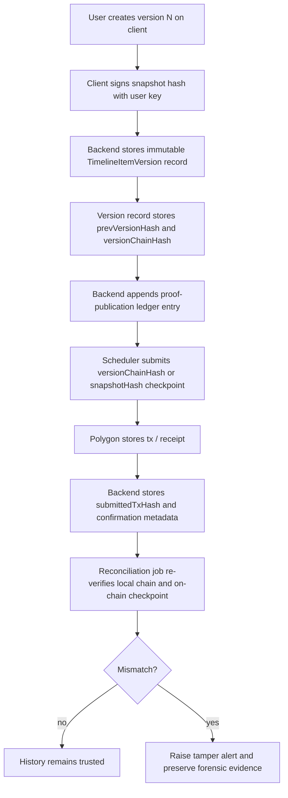

# Timeline Proof Against an Untrusted Admin

## Why this document exists

The existing event-proof flow explains how timeline snapshots are anchored on Polygon and how retries, pending states, and reconciliation work.

This document focuses on a harder question:

**What if the database admin is not trusted and is itself one side of the dispute?**

That changes the security model completely.

In this threat model, the admin may try to:

- delete an unsigned timeline version before it is anchored,
- replace the payload of version 2 with the payload of version 1,
- reorder or rewrite `versionHistory`,
- delete or alter `proofHistory`,
- force tasks to `FAILED` so anchoring never happens,
- hide temporary states so there is no visible audit trace of tampering.

If that is the threat model, then Polygon by itself is **not enough**.

---

## The core problem

If the app stores timeline history in mutable Mongo documents, then a privileged admin can rewrite local history **before** the relevant snapshot is anchored on-chain.

That creates two categories of risk:

## 1. Pre-anchor erasure

If version 1 existed only in Mongo and had not yet been checkpointed to Polygon, a malicious admin can try to remove it from the local record entirely.

Then later:

- version 2 is shown as if it had always been version 1,
- the original content disappears from ordinary app history,
- a later on-chain proof may still exist for a newer version, while the older missing version is never externally committed.

## 2. Post-anchor local rewriting

If a version was already anchored, the admin still cannot change what Polygon recorded, but it may try to:

- tamper with the local copy,
- remove the matching snapshot from Mongo,
- present a misleading local history,
- rely on the fact that most users or reviewers will never perform blockchain verification.

So the real goal is not only "store a blockchain proof".

The real goal is:

**make local history append-only enough that tampering is either impossible, or immediately detectable, or provably inconsistent with the external checkpoint.**

---

## Short answer: is the current system enough?

No, not against an untrusted admin.

The current system is good for:

- integrity of already anchored snapshots,
- retrying publication,
- reducing duplicate blockchain writes,
- audit-friendly versioned history under normal backend trust assumptions.

But it is **not yet the strongest defensible architecture** against a malicious Mongo admin who can rewrite data before anchor completion.

---

## What the strongest practical defense looks like

The strongest practical design for this project is:

- **append-only version ledger in application data**
- **hash chain between versions**
- **separate append-only publication ledger**
- **regular blockchain checkpoints of that ledger**
- **reconciliation and tamper verification jobs**
- optionally **client/user signatures per version**

That means Polygon becomes an external checkpoint of a stronger local structure, instead of being the only integrity mechanism.

---

## Recommended architecture

## 1. Make timeline versions append-only

Current risk:

- one Mongo document holds `versionHistory[]`
- admin can rewrite the array in place

Recommended change:

- represent each timeline version as its own immutable record
- never update a historical version row/document in place
- only append a new version document

Example conceptual model:

```text
TimelineItemHead
- itemId
- latestVersion
- latestVersionHash

TimelineItemVersion
- itemId
- version
- snapshot
- snapshotHash
- prevVersionHash
- createdAt
- createdBy
- userSignature (optional but recommended)
- status
```

With this structure, replacing version 2 with version 1 becomes much harder to hide, because:

- versions are separate records,
- each version references the previous one,
- deletion or substitution breaks the chain.

---

## 2. Add a hash chain between versions

Each version should contain:

- `snapshotHash = hash(snapshot)`
- `prevVersionHash`
- `versionChainHash = hash(itemId + version + snapshotHash + prevVersionHash + metadata)`

This creates a local tamper-evident chain.

If an admin:

- deletes version 1,
- replaces version 2 snapshot,
- rewrites version ordering,

then later chain verification fails.

### Why this matters

Polygon only proves what was anchored externally.

The local hash chain proves whether the local sequence of versions is internally consistent.

Together they give a much stronger story:

- local history is tamper-evident,
- external chain checkpoints prove that local chain state existed at or before a certain time.

---

## 3. Separate proof publication state from timeline content

Today proof state is embedded inside `proofHistory` on the timeline item structure.

That is convenient, but not ideal for an adversarial-admin model.

Recommended addition:

- a dedicated append-only `TimelineProofPublication` ledger

Example:

```text
TimelineProofPublication
- proofId
- itemId
- version
- versionChainHash
- snapshotHash
- status: CLAIMED | SUBMITTED | CONFIRMED | FAILED | RECONCILING
- submittedTxHash
- blockNumber
- anchoredAt
- prevPublicationHash
- publicationRecordHash
```

This lets you protect and audit publication lifecycle independently from mutable read models.

---

## 4. Add periodic ledger checkpoints on Polygon

Anchoring every single timeline version is the strongest simple model, but may become expensive or noisy.

A stronger scalable approach is:

- keep append-only local version chain,
- periodically checkpoint the head hash to Polygon,
- optionally also anchor critical versions individually.

That gives two layers:

- per-version local tamper evidence,
- periodic external notarization.

### Example

At time T, checkpoint on Polygon stores:

- `globalTimelineLedgerHeadHash`

Then if an admin later deletes an old local version, recomputing the ledger head will no longer match the historical checkpoint chain.

---

## 5. Add verification and reconciliation jobs

This is mandatory in an untrusted-admin model.

You need jobs that periodically:

- recompute snapshot hashes,
- recompute per-item version chains,
- recompute global ledger head,
- verify that claimed Polygon tx hashes really exist,
- verify receipts and block numbers,
- compare local stored chain heads with previously anchored chain heads,
- mark any mismatch as a tamper alert.

This answers the question:

## Can we later ask Polygon about a tx?

**Yes.**

If you have:

- `txHash`, or
- block/receipt references,

you can query Polygon later and verify:

- whether the tx exists,
- what data was actually submitted,
- whether it was mined,
- in which block,
- and whether that on-chain payload matches the expected hash.

What you **cannot** do is recover a tx you never stored and cannot rediscover from any deterministic index.

So the system should store at least:

- `submittedTxHash`
- expected `snapshotHash`
- expected `versionChainHash`
- publication timestamps

as soon as possible after submission.

---

## Important limitation: Polygon cannot prove versions that never escaped Mongo

This is the hardest point and the one you were worried about.

Scenario:

- user creates version 1
- version 1 exists only locally for a short time
- admin kills or fails the publication task
- admin removes version 1 from Mongo
- version 2 is rewritten to look like version 1 or history is reshaped

If version 1 was never externally committed anywhere, then Polygon cannot later prove that version 1 existed.

That is why the strongest architecture needs one of these strategies:

1. **anchor each version quickly**
2. **write each version to an append-only local ledger that is itself regularly checkpointed externally**
3. **have the client hold or co-sign evidence of each version**

Without one of those, pre-anchor erasure remains a real blind spot.

---

## Best defense against the exact malicious-admin scenario you described

You described this scenario:

- bad admin removes an unsigned payload from history,
- swaps payloads so version 2 becomes effectively version 1,
- sets task to `FAILED` so signing never happens,
- tries to permanently erase the old entry.

The strongest defense is a combination of five things:

## A. Append-only version records

No in-place rewriting of old versions.

## B. Per-version hash chain

Every version points cryptographically to the previous one.

## C. External checkpoints

Regularly anchor the head of the chain to Polygon.

## D. Independent proof publication ledger

Do not let task state be the only source of truth.

## E. Optional client signatures on each version

If the user device signs each version snapshot before upload, then even a bad admin cannot plausibly fabricate a different historical payload and claim it was original user content.

This last point is extremely valuable if the system is supposed to support disputes.

---

## Strongest practical model



---

## What can be detected later

If the stronger model is implemented, later verification can detect:

- missing intermediate versions,
- substituted version payloads,
- broken `prevVersionHash` links,
- mismatch between expected hash and on-chain hash,
- stored `txHash` that does not exist on Polygon,
- proof records that claim confirmation but have no valid receipt,
- local head hash that no longer matches historic checkpoint anchors.

That is the key distinction:

- **prevention** is hard,
- **tamper-evident detection** is realistic and strong,
- **forensic reconstruction** becomes possible if enough metadata is preserved.

---

## What cannot be fully prevented

Even with the strongest practical architecture, a malicious infrastructure owner can still:

- stop the application,
- block outbound RPC,
- delay task execution,
- refuse to publish new checkpoints,
- censor UI visibility.

What the architecture can do is make those actions visible and provable later.

That is often the real goal in dispute-grade systems:

not "admin can never interfere", but rather

**admin cannot interfere without leaving detectable cryptographic evidence of interference or absence of expected checkpoint continuity.**

---

## Recommended project tasks

Below is the backlog I would add to the project.

## Phase 1 - close the biggest blind spots

### Task 1. Add explicit proof lifecycle state

Introduce explicit states such as:

- `CLAIMED`
- `SUBMITTED`
- `CONFIRMED`
- `FAILED`
- `RECONCILING`

Why:

- easier recovery,
- better observability,
- better separation between local proof intent and final blockchain confirmation.

### Task 2. Persist `submittedTxHash` immediately after tx submission

As soon as the chain returns a tx hash, store it before waiting for final receipt.

Why:

- later Polygon reconciliation becomes possible,
- avoids blind spot where tx exists but app forgot it.

### Task 3. Add reconciliation worker for pending/submitted proofs

Worker responsibilities:

- query Polygon by `submittedTxHash`
- finalize receipt if mined
- flag stale or inconsistent records

Why:

- directly addresses the worst distributed failure case.

---

## Phase 2 - defend against malicious local history rewriting

### Task 4. Move timeline versions to append-only records

Replace mutable `versionHistory[]` as the primary integrity structure with immutable per-version records.

Why:

- prevents silent in-place rewrite of old versions,
- makes deletions and substitutions easier to detect.

### Task 5. Add per-version hash chaining

Each version record stores:

- `snapshotHash`
- `prevVersionHash`
- `versionChainHash`

Why:

- deletion or substitution breaks the chain.

### Task 6. Add a global timeline ledger head

Maintain a global or per-item ledger head hash derived from the latest append-only version chain.

Why:

- enables periodic compact checkpoints on Polygon.

---

## Phase 3 - external notarization and tamper detection

### Task 7. Add periodic Polygon checkpoints for chain heads

Checkpoint:

- per-item head hash, or
- global ledger head hash

Why:

- makes later local history rewriting externally detectable.

### Task 8. Add tamper verification job

Job should:

- recompute version chains,
- compare current heads to historical checkpoints,
- emit tamper alerts on mismatch.

### Task 9. Add admin/support read model for proof integrity status

Expose:

- proof state,
- tx status,
- reconciliation status,
- tamper check result,
- last known good checkpoint.

Why:

- operators need more than just “proof not found”.

---

## Phase 4 - stronger authorship guarantees

### Task 10. Add client-side signatures per timeline version

Before upload, client signs the snapshot hash or canonical snapshot payload.

Why:

- malicious admin can no longer plausibly rewrite historical payload and claim it came from the user unchanged.

### Task 11. Preserve key identifiers and verification metadata per version

Store:

- signer key id
- signature timestamp
- signature algorithm/version

Why:

- necessary for later validation and evidentiary export.

---

## Phase 5 - exports and verification tooling

### Task 12. Add forensic export bundle for one timeline item

Export should include:

- all immutable versions,
- all hashes,
- all chain links,
- all publication records,
- tx hashes and receipts,
- verification report.

Why:

- lets a third party verify history independently.

### Task 13. Add standalone verification command

Example:

```bash
bun run verify:timeline-proof --item <id>
```

Output should say:

- chain intact / broken
- missing versions
- txs found / not found on Polygon
- last valid checkpoint

---

## One concrete task to add first

If you want one task that is the highest-leverage starting point, I would add this first:

### Task: Introduce submitted transaction persistence and proof reconciliation

**Goal:** eliminate the blind spot where Polygon accepted a timeline proof transaction but Mongo never finalized the proof metadata.

**Scope:**

- add explicit proof lifecycle state
- store `submittedTxHash` immediately after blockchain submission
- add reconciliation worker that re-queries Polygon for pending/submitted proofs
- finalize proofs from receipts when found
- mark irrecoverable cases for operator review

**Why first:**

- it addresses the worst current technical risk,
- it is much cheaper than a full append-only redesign,
- it lays the groundwork for stronger anti-tamper architecture.

---

## One concrete task after that

### Task: Redesign timeline version history into an append-only hash-chained ledger

**Goal:** make malicious local rewriting of version history cryptographically detectable.

**Scope:**

- replace mutable version array as the integrity source of truth
- persist immutable per-version records
- add `prevVersionHash` and `versionChainHash`
- add verification job for broken chains
- prepare the structure for periodic Polygon checkpoints

**Why second:**

- this is the real anti-malicious-admin milestone,
- it turns timeline history from a normal app record into a tamper-evident ledger.

---

## Final recommendation

If the admin is one side of the dispute, then the right goal is not simply “publish more to Polygon”.

The right goal is:

**build a local append-only cryptographic history and use Polygon as an external notarization layer for that history.**

That is the strongest practical defense available in this architecture.
